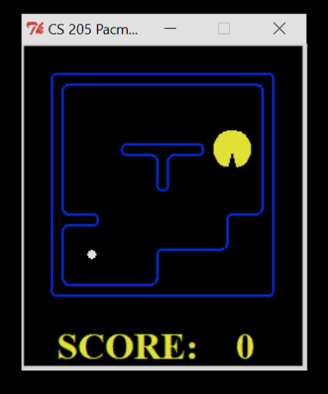
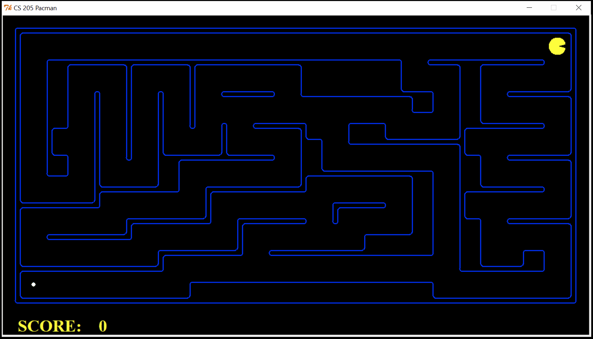
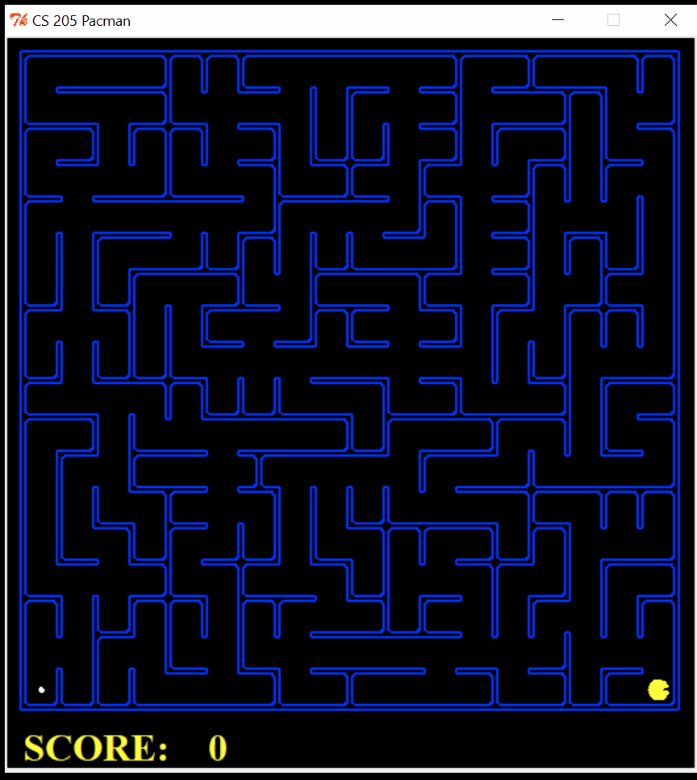
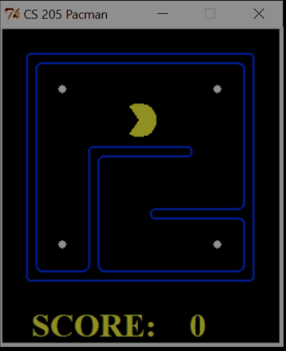
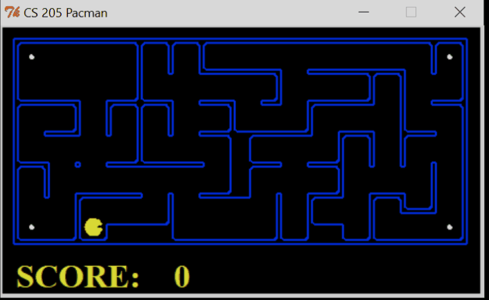

# Pacman - An Automated Search Project

##### Python ver 2.7

The Pacman agent will find paths through his maze world, both to reach a particular location and to collect food efficiently. General search algorithms are applied to each of the Pacman scenarios. 

## Code Template Source:
http://ai.berkeley.edu/search.html 

## Contributors:
Zhenyu Yang 
Hui Su 
Wendy Liu 

## Usage
<pre>
USAGE: python pacman.py <options>
EXAMPLES: 
    (1) python pacman.py
         - starts an interactive game  
    (2) python pacman.py --layout smallClassic --zoom 2
    OR  python pacman.py -l smallClassic -z 2
        - starts an interactive game on a smaller board, zoomed in

Options:
  -h, --help |           show this help message and exit
  -n GAMES, --numGames=GAMES
                        the number of GAMES to play [Default: 1]
  -l LAYOUT_FILE, --layout=LAYOUT_FILE
                        the LAYOUT_FILE from which to load the map layout
                        [Default: mediumClassic]
  -p TYPE, --pacman=TYPE
                        the agent TYPE in the pacmanAgents module to use
                        [Default: KeyboardAgent]
  -t, --textGraphics    Display output as text only
  -q, --quietTextGraphics
                        Generate minimal output and no graphics
  -g TYPE, --ghosts=TYPE
                        the ghost agent TYPE in the ghostAgents module to use
                        [Default: RandomGhost]
  -k NUMGHOSTS, --numghosts=NUMGHOSTS
                        The maximum number of ghosts to use [Default: 4]
  -z ZOOM, --zoom=ZOOM  Zoom the size of the graphics window [Default: 1.0]
  -f, --fixRandomSeed   Fixes the random seed to always play the same game
  -r, --recordActions   Writes game histories to a file (named by the time
                        they were played)
  --replay=GAMETOREPLAY
                        A recorded game file (pickle) to replay
  -a AGENTARGS, --agentArgs=AGENTARGS
                        Comma separated values sent to agent. e.g.
                        "opt1=val1,opt2,opt3=val3"
  -x NUMTRAINING, --numTraining=NUMTRAINING
                        How many episodes are training (suppresses output)
                        [Default: 0]
  --frameTime=FRAMETIME
                        Time to delay between frames; 
                        <0 means keyboard
                        [Default: 0.1]
  -c, --catchExceptions
                        Turns on exception handling and timeouts during games
  --timeout=TIMEOUT     Maximum length of time an agent can spend computing in
                        a single game [Default: 30]
</pre>

 
Hint: If Pacman moves too slowly for you, try the option --frameTime 0.

  

## Tasks
### Finding a Fixed Food Dot using Depth First Search

&nbsp; `python pacman.py -l tinyMaze -p SearchAgent -a fn=tinyMazeSearch`  

 

 

&nbsp; `python pacman.py -l tinyMaze -p SearchAgent`  
&nbsp; `python pacman.py -l mediumMaze -p SearchAgent`  
&nbsp; `python pacman.py -l bigMaze -z .5 -p SearchAgent` 

### Breadth First Search

&nbsp; `python pacman.py -l mediumMaze -p SearchAgent -a fn=bfs`  
&nbsp; `python pacman.py -l bigMaze -p SearchAgent -a fn=bfs -z .5`  

### Varying the Cost Function
&nbsp; `python pacman.py -l mediumMaze -p SearchAgent -a fn=ucs`  
&nbsp; `python pacman.py -l mediumDottedMaze -p StayEastSearchAgent`  
&nbsp; `python pacman.py -l mediumScaryMaze -p StayWestSearchAgent`  

 

 
The red path represents the search nodes expanded by the current algorithm. 

### A* search

&nbsp; `python pacman.py -l bigMaze -z .5 -p SearchAgent -a fn=astar,heuristic=manhattanHeuristic`  

A* search is more optimized as a solution for this problem because 
 

 

### Finding All the Corners

&nbsp; `python pacman.py -l tinyCorners -p SearchAgent -a fn=bfs,prob=CornersProblem` 
This command help Pacman to traverse all the corners in the current map (even without the presence of the food dots).
 

 

&nbsp; `python pacman.py -l mediumCorners -p SearchAgent -a fn=bfs,prob=CornersProblem` 

### Corners Problem: Heuristic

&nbsp; `python pacman.py -l mediumCorners -p AStarCornersAgent -z 0.5`
 

 

&nbsp; `python pacman.py -p SearchAgent -a fn=aStarSearch,prob=CornersProblem,heuristic=cornersHeuristic` 

### Eating All The Dots

&nbsp; `python pacman.py -l trickySearch -p AStarFoodSearchAgent` 

### Suboptimal Search

&nbsp; `python pacman.py -l bigSearch -p ClosestDotSearchAgent -z .5` 